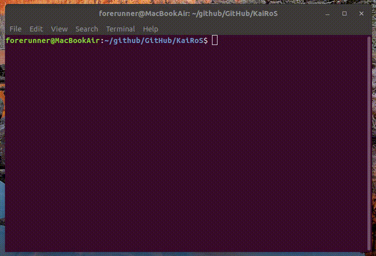
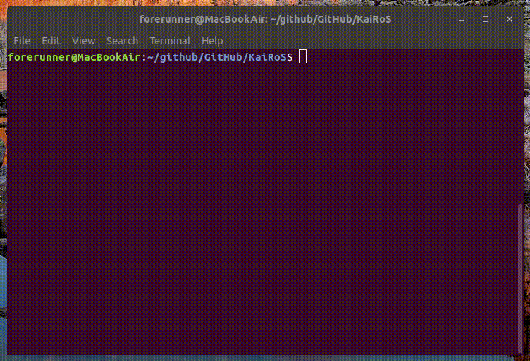
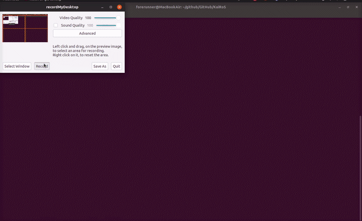

# KaiRoS

### A simple, easy to use terminal weather app.


**dependencies**

   

**How to use it ?**

_current weather_, _forecast_, and even _a logo in the ascii art style_… what more can you hope for?




**Is it useless ?**

~~Well, maybe.~~ Of course it’s not useless. In fact, it’s quite useful. With it you’ll be able to check the weather forecast! Isn’t it exciting?


**Why would I want it ?**

Well, sometimes you just want to see the weather without the hazard of opening a new browser or moving your hand away from the keyboard. That’s where `KaiRoS` comes in.


**What about the used and “proven” `wttr.in` ?**

 

Pretty self. explanatory. `wttr.in` is not as efficient and/or reliable as `kairos`, also, you need `curl` for it to work… 


**How do I get it ?**

It is uploaded to **PyPI**, so everyone can download it with 

```bash
$ python3 -m pip install wkairos --user
```

###### by “everyone” I mean everyone with Linux/OSX installed.


**What does `kairos` mean ?**

It means _weather_ in Greek. It’s the name only because it sounds nice (I basically looked that up using [google translate](https://translate.google.com))